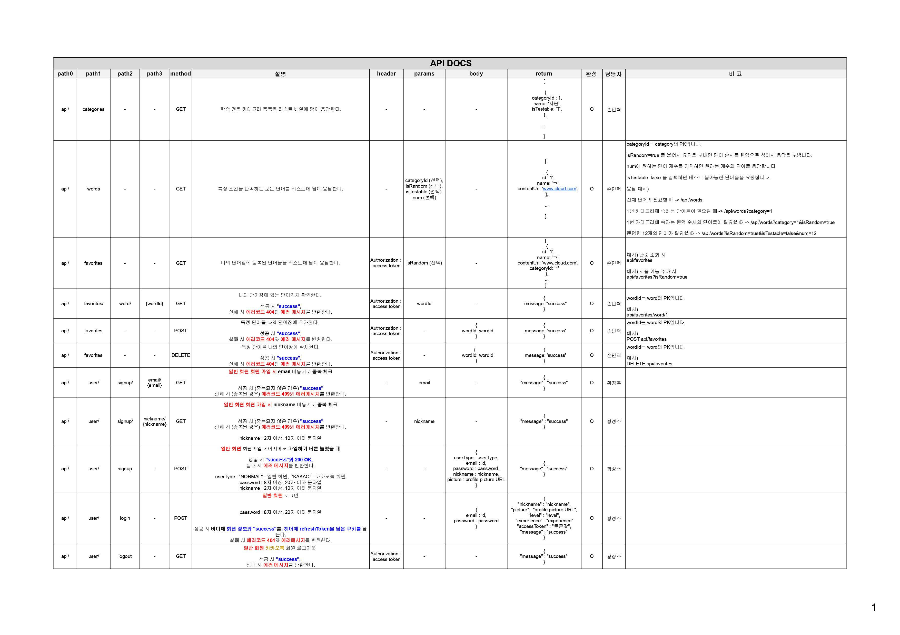
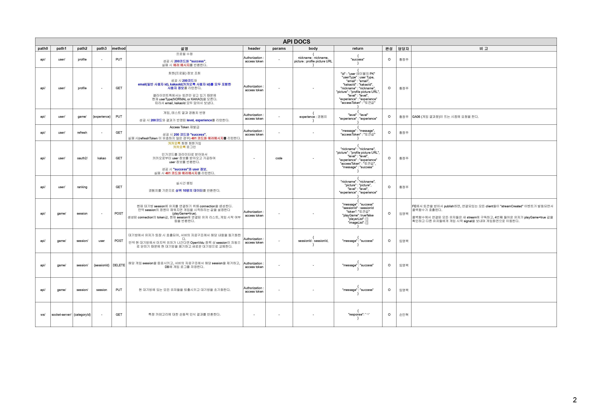

# 손:걸음

### 🤖 README 작업 중입니다 🤖

 

이 자리에 메인배너 추가하면 좋을 것 같아요.

## 프로젝트 개요

SSAFY 8기 2학기 공통 프로젝트

2023.01.09 ~ 2023.02.17 (39일)

 

## [수어 관련 사회적 배경]

현재 농인들과 수어 관련한 어떤 사회적 배경이 있는지 기재합니다.

 

## [해결해야 할 문제점]

우리가 해결해야할 문제점을 명시하고, 우리의 서비스가 필요한 이유와 어떻게 이 문제를 개선/해결할 수 있는지 명확히 기재합니다.

 

## 손:걸음 서비스 화면

여기에 간단한 기능설명과 함께 시연 GIF들을 추가합니다.

 

## 주요기능

위에 서비스 화면과 같이 설명한 부분을 더 상세하게 기재합니다.

 

## 개발환경

개발환경을 기재합니다. (포팅매뉴얼 참고)

 

## 프로젝트 구조

FE, BE 프로젝트 구조를 트리 다이어그램? 형식으로 기재합니다 (선택)

 

## 와이어프레임

 

## ERD

 

## 서비스 아키텍쳐

 

## 기능명세서

 

## API DOCS

 

## 기술 차별점

기술적인 부분에서 우리의 서비스의 차별점을 상세히 기재합니다.

 

## 협업 툴

협업 툴을 기재합니다. (포팅매뉴얼 참고)

 

## 협업 환경

협업 환경을 상세히 기재합니다. (Git Flow, Jira, 회의(Scrum, Spring), Notion 활용 방법 등

 

## 팀원 역할

팀원들이 각자 맡은 역할을 기재합니다. (발표자료 첨부해도 좋을 듯 해요)

 

## 프로젝트 산출물

- [요구사항정의서](docs/SonGeoreum_%EC%9A%94%EA%B5%AC%EC%82%AC%ED%95%AD%EC%A0%95%EC%9D%98%EC%84%9C.pdf)
- [기능명세서](docs/SonGeoreum_%EA%B8%B0%EB%8A%A5%EB%AA%85%EC%84%B8%EC%84%9C.pdf)
- [와이어프레임](docs/SonGeoreum_wireframe.png)
- [ERD](docs/SonGeoreum_erd.png)
- [아키텍쳐 다이어그램](docs/SonGeoreum_architecture.png)
- [API DOCS](docs/SonGeoreum_api.pdf)
- [Git Convention](docs/SonGeoreum_git_convention.pdf)
- [포팅 매뉴얼](exec/SonGeoreum_%ED%8F%AC%ED%8C%85_%EB%A7%A4%EB%89%B4%EC%96%BC.pdf)

 

## 프로젝트 발표 자료

- [중간발표 Presentation](docs/SonGeoreum_%EC%A4%91%EA%B0%84%EB%B0%9C%ED%91%9C%EC%9E%90%EB%A3%8C.pdf)
- [최종발표 Presentation]

 
