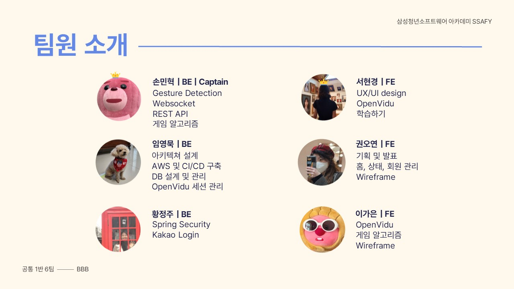

# 손:걸음

### 🤖 README 작업 중입니다 🤖

<br>


(현경님)

## 프로젝트 개요

SSAFY 8기 2학기 공통 프로젝트

2023.01.09 ~ 2023.02.17 (39일)

<br>

## [수어 관련 사회적 배경]

현재 농인들과 수어 관련한 어떤 사회적 배경이 있는지 기재합니다.
(오연님)

<br>

## [해결해야 할 문제점]

우리가 해결해야할 문제점을 명시하고, 우리의 서비스가 필요한 이유와 어떻게 이 문제를 개선/해결할 수 있는지 명확히 기재합니다.
(오연님)

<br>

## 주요기능

### 학습 단어장

- 카테고리를 골라서 필요한 단어를 학습해 보세요.
- 뜻이 적힌 단어 카드를 뒤집어 수어를 확인할 수 있습니다.
- 셔플 버튼을 눌러 순서를 섞어보세요.
- 목록 버튼을 누르면 작은 단어 카드 목록을 한눈에 확인할 수 있습니다.
- 기록해두고 싶은 단어는 별 버튼을 눌러 나의 단어장에 저장하고 확인 해보세요.

### 수어 테스트

- 원하는 카테고리를 골라 나의 수어 실력을 확인해보세요.
- 틀린 문제는 충분히 복습 후에 넘어갈 수 있습니다.
- 테스트 결과에 따라 나의 경험치를 쌓을 수 있습니다.
- **수어를 단어로 맞추기**
  - 수어 이미지 혹은 동영상을 보고 뜻을 입력해보세요.
- **단어를 수어로 맞추기**
  - 제시어를 보고 웹캠으로 수어를 표현해보세요.
  - 웹캠에서 손동작을 인식해 정답을 체크할 수 있습니다.

### 화상게임

- 수어는 동작 뿐만 아니라 표정, 입모양도 중요합니다.
- 실시간 매칭을 통해 다양한 사람들과 “수어로 말해요” 게임을 즐겨보세요.
- 출제자는 제시어와 영상을 보고 수어를 표현해보세요.
- 다른 사람들은 출제자의 표현을 보고 채팅에 정답을 입력할 수 있습니다.
- 모두가 돌아가면서 출제자가 될 수 있습니다.
- 제한 시간 안에 정답을 맞추어 점수를 획득하세요.
- 게임이 종료되면 결과창에서 나의 등수를 확인해보세요.

<br>

## 손:걸음 서비스 화면

### 홈 화면

- “손걸음” 서비스에 대해 소개합니다.
- 상단바에서 학습하기, 게임하기, 로그인을 진행할 수 있습니다.

### 로그인

- 아이디, 비밀번호를 입력해 로그인을 합니다.
- 카카오 간편 로그인도 사용할 수 있습니다.

### 회원가입

- 이메일, 닉네임, 비밀번호, 프로필 이미지를 입력해 회원가입을 합니다.
- 올바른 이메일 형식을 사용해야 합니다.
- 2~8자의 닉네임을 사용해야 합니다.
- 8~20자의 비밀번호를 사용해야 합니다.
- 주어진 12개의 프로필 이미지 중 선택합니다.

### 학습하기

- 모든 단계에서 화살표 버튼을 눌러 이전 선택으로 돌아갈 수 있습니다.
- 학습모드(배움모드, 실전모드)를 선택합니다.

[모드선택]

- 리스트 중 원하는 카테고리를 선택합니다.
  - 무한 스크롤이 적용됩니다.

[카테고리선택]

### 배움모드

- 뜻이 적혀있는 단어카드를 클릭해 뒤집을 수 있습니다.
- 뒤집은 카드에서 수어 이미지/영상을 확인할 수 있습니다.
- 화살표 버튼이나 오른쪽 목록에서 다음 단어로 넘기고 선택할 수 있습니다.
- TEST 버튼을 눌러 선택한 카테고리의 “실전모드”를 진행할 수 있습니다.

[단어카드 뒤집기]

- 별 버튼을 클릭해 나의 단어장에 저장해둘 수 있습니다.

[별버튼]

- 목록 버튼을 클릭해 단어 목록을 한 눈에 확인할 수 있습니다.

[목록버튼]

- 셔플 버튼을 클릭해 단어 목록 순서를 섞을 수 있습니다.

[셔플버튼]

### 실전모드

- 총 10문제에 대한 테스트를 진행합니다.
- 실전 모드 진행 중 언제든 종료할 수 있습니다.
- 실전방법을 선택합니다.

[실전방법 선택]

### 실전 - 수어를 단어로

- 튜토리얼을 진행합니다.
- 수어 이미지/영상을 보고 정답 뜻을 입력합니다.
- 정답 시 컨페티 효과가 보이고 자동으로 다음 문제로 넘어갑니다.

[정답]

- 오답 시 정답을 확인합니다.
- 충분히 정답을 복습했으면 다음 버튼을 눌러 넘어갑니다.

[오답]

### 실전 - 단어를 수어로

- 튜토리얼을 진행합니다.
- 제시어를 보고 웹캠 앞에서 정답 수어를 표현합니다.
- 화면에서 손동작 인식 상황을 확인할 수 있습니다.
- 정답 시 컨페티 효과가 보입니다.

[정답]

- 잘 모르겠으면 PASS 버튼을 눌러 넘어갑니다.
- 모범 수어 동작을 확인합니다.
- 충분히 확인 했으면 다음 버튼을 눌러 다음 문제로 넘어갑니다.

[다음문제]

- 실전 테스트가 끝나면 결과창에서 점수를 확인할 수 있습니다.

[결과]

### 게임하기

- 대기 로딩 화면에서 현재 매칭 상황을 확인합니다
- 기다리는 동안 수어에 대한 팁을 확인할 수 있습니다.

[대기화면]

- 4명이 매칭이 되면 자동으로 게임을 시작합니다.
- 출제자는 제시어와 영상을 보고 수어를 표현해보세요.
- 다른 사람들은 출제자의 표현을 보고 채팅에 정답을 입력할 수 있습니다.

[게임진행]

- 총 12턴이 지나면 게임이 종료됩니다.
- 게임이 종료되면 결과창에서 나의 점수와 등수를 확인해보세요.

[결과]

### 내 정보

- 상단 바의 나의 프로필 사진을 클릭합니다.
- 사이드 바에서 나의 프로필 사진과 경험치를 확인할 수 있습니다.
- 프로필 수정 버튼을 눌러 닉네임과 프로필 사진을 수정할 수 있습니다.

[사이드바+정보수정]

### 나의 단어장

- 즐겨찾기(별버튼) 단어를 확인할 수 있습니다.

[나의단어장]

<br>

## 기술 차별점

기술적인 부분에서 우리의 서비스의 차별점을 상세히 기재합니다.
(모두)

- 공통 컴포넌트 및 CSS 모듈화
  - MUI theme과 MUI API를 커스텀하여 쉽게 재사용이 가능하도록 모듈화하였습니다.

<br>

## 개발환경

### Frontend

- Node.js 18.13.0 (LTS)
- React 18.2.0
  - Redux 4.2.1
- mui/material 5.11.6
- axios 1.2.6
- Sass 1.57.1
- Openvidu Browser 2.24.0
- jQuery 3.6.3

### Backend

- Java
  - Java OpenJDK 1.8.0
  - Spring Boot 2.7.7
    - Spring Data JPA 2.7.6
    - Spring Security 5.7.6
    - JUnit 4.13.2
    - Lombok 1.18.24
    - Swagger 3.0.0
  - Gradle 7.6
- Python
  - Python 3.8.10
  - Django 4.1.5
  - OpenCV 4.5.5.64
  - MediaPipe 0.9.0.1

### Server

- Ubuntu 20.04 LTS
- Nginx 1.18.0
- Docker 20.10.23
- Docker Compose 2.15.1
- OpenVidu 2.24.0

### Database

- MySQL (AWS RDS) 8.0.30

### UI/UX

- Figma 93.4.0

### IDE

- Visual Studio Code 1.75
- IntelliJ IDEA 2022.3.1
- PyCharm 22.3.2

### 기타 툴

- Postman 10.9.4
- Termius 7.56.1

<br>

## 프로젝트 구조

### Frontend (React)

```
SonGeoreum
├── app
├── assets
│   ├── category
│   ├── fonts
│   ├── home
│   ├── level
│   ├── logo
│   ├── profile
│   ├── result
│   └── socialLogin
├── common
│   ├── api
│   ├── button
│   ├── card
│   ├── category
│   ├── error
│   ├── navbar
│   └── routes
└── features
    ├── additional
    ├── auth
    │   ├── login
    │   ├── modify
    │   └── signup
    ├── game
    │   ├── effect
    │   └── openVidu
    │       ├── assets
    │       │   └── images
    │       ├── components
    │       │   ├── dialog-extension
    │       │   ├── sidebar
    │       │   │   └── chat
    │       │   ├── stream
    │       │   └── toolbar
    │       ├── docker
    │       ├── layout
    │       └── models
    ├── home
    ├── study
    │   ├── learn
    │   └── test
    └── voca
```

### Backend (Spring Boot)

```
SonGeoreum
├── api
│   ├── controller
│   ├── request
│   ├── response
│   └── service
├── config
├── db
│   ├── domain
│   └── repository
├── exception
├── jwt
│   └── filter
├── oauth
│   ├── entity
│   ├── handler
│   ├── info
│   └── service
└── util
```

### Backend (Django)

```
SonGeoreum
├── Dockerfile
├── README.md
├── handdetection
│   ├── __init__.py
│   ├── admin.py
│   ├── apps.py
│   ├── consumers.py
│   ├── knn.py
│   ├── migrations
│   │   └── __init__.py
│   ├── models.py
│   ├── routing.py
│   ├── templates
│   │   └── handdetection
│   │       └── lobby.html
│   ├── tests.py
│   ├── urls.py
│   └── views.py
├── knn_dataset_consonant.txt
├── knn_dataset_number.txt
├── knn_dataset_vowel.txt
├── manage.py
├── mywebsite
│   ├── __init__.py
│   ├── asgi.py
│   ├── settings.py
│   ├── urls.py
│   └── wsgi.py
└── requirements.txt
```

<br>

## 와이어프레임


(가은님)

<br>

## ERD


(가은님)

<br>

## 서비스 아키텍쳐


(가은님)

<br>

## 협업 툴

- Git
- GitLab
- Jira
- Notion
- Mattermost

<br>

## 협업 환경

협업 환경을 상세히 기재합니다. (Git Flow, Jira, 회의(Scrum, Spring), Notion 활용 방법 등
(민혁님)
(가은님)

<br>

## 팀원 역할


(정주님)

<br>

## 프로젝트 산출물

- [요구사항정의서](docs/SonGeoreum_%EC%9A%94%EA%B5%AC%EC%82%AC%ED%95%AD%EC%A0%95%EC%9D%98%EC%84%9C.pdf)
- [기능명세서](docs/SonGeoreum_%EA%B8%B0%EB%8A%A5%EB%AA%85%EC%84%B8%EC%84%9C.pdf)
- [와이어프레임](docs/SonGeoreum_wireframe.png)
- [ERD](docs/SonGeoreum_erd.png)
- [아키텍쳐 다이어그램](docs/SonGeoreum_architecture.png)
- [API DOCS](docs/SonGeoreum_api.pdf)
- [Git Convention](docs/SonGeoreum_git_convention.pdf)
- [포팅 매뉴얼](exec/SonGeoreum_%ED%8F%AC%ED%8C%85_%EB%A7%A4%EB%89%B4%EC%96%BC.pdf)

<br>

## 프로젝트 발표자료

- [중간발표 Presentation](docs/SonGeoreum_%EC%A4%91%EA%B0%84%EB%B0%9C%ED%91%9C%EC%9E%90%EB%A3%8C.pdf)
- [최종발표 Presentation]
  (정주님)

<br>

## 회고

프로젝트를 진행하며 배운 점들과 느낀 점들을 기재합니다.
(모두)

서현경: 처음으로 프로젝트 일지를 작성해봤는데 내가 무엇을 했는데 복기하는데에도 도움이 됐지만 팀원분들이 열심히 하는 모습이 더 잘 보여서 동기부여가 됐다. 또, 일지에 만났던 오류나 문제를 작성하고는 했는데, 같은 에러가 나면 일지를 보고 고친 적이 종종 있어서 기록이 얼마나 중요한지 알게 되었다. 후반부에는 바쁘다고 제대로 작성하지 못한 게 아쉽다. 전반적으로 정말 멋있는 팀원분들 만나서 긍정적인 시너지를 많이 받았고 덕분에 내 실력도 많이 커진 것 같아서 너무너무 감사하다. 결과가 어떻든 이번 프로젝트 과정에서 최선을 다했기 때문에 후회가 없다!
