# 손:걸음


## 프로젝트 개요

SSAFY 8기 2학기 공통 프로젝트

2023.01.09 ~ 2023.02.17 (39일)

<br>

## 프로젝트 기획 배경

‘농인’을 아시나요? 흔히 청각, 언어장애인으로 알려진 이들인데요. 이들은 스스로를 ‘청각을 사용하지 않는 사람’으로 정체화하고, 모국어로 ‘한국수어’를 사용하는 등 독자적인 ‘농문화’를 확립하고 있습니다. 또한 수어의 한국 공용어 제정, 농인 기업 설립을 통한 경제적 자립 등 사회적으로 인정받고, 인식을 개선하기 위해 다양한 노력을 하고 있습니다. 
<br>
<br>
하지만 이런 노력과는 달리, 청인 사회의 인식은 아직 부족하기만 합니다.<br>
농인을 위한 교육기관인 농학교의 교사 중 수어 통역 자격증 보유자는 6%에 불과하며, 금융기관과 관공서에서는 그들에게는 외국어와 다름없는 한글로 필담 서비스를 제공하는 등 사회 전반적으로 농인과 농문화에 대한 인지가 매우 낮은 수준입니다.
<br>
<br>
농인을 단순히 장애인으로 인식하고 있는 현실은 청인과 농인 사이의 소통의 단절을 야기하며, 더 나아가 관계 단절의 원인이 되기도 합니다.  
이러한 문제를 해결하고자, `청인들의 농문화 인식을 개선하기 위한 프로젝트`를 기획했습니다.

<br>

## 문제 해결을 위한 솔루션
**“제 2의 언어를 갖는 것은 제 2의 영혼을 갖는 것과 같다.”** 
-스탠퍼드 대학 언어인지학 교수 레라 보로딧츠키

언어 학습은 해당 문화권을 이해하는 데에 매우 효과적인 수단입니다. 이에 착안하여, `수어 교육`을 통해 농문화를 알리고 쉽게 이해시키고자 했습니다. 또한 효과적인 대중화와 인식 개선을 위하여 재미 요소를 강조한 `게임` 컨텐츠를 가미했습니다.

**게임으로 재미있게 배우는 기초 수어 교육 서비스**

수어의 대중화를 통해 농인과 농문화의 존재를 인지시키고, 서로 다른 문화에 대한 이해를 통해 ‘다름’을 존중하며 공존하는 사회를 형성하고자 합니다.

<br>

## 서비스명 & 슬로건 & 로고


**당신과 함께하는 첫 수어, 손걸음**
<br>
우리의 궁극적인 목표는 `농인과 청인이 동등한 사회구성원으로서 공존하는 사회`입니다.

공존을 위한 첫걸음을 수어로써 함께하겠다는 의미와 더불어, 공존의 가치를 이어나갈 것을 약속하겠다는 의미를 담았습니다.

<br>

## 주요기능

### 학습 단어장

- 카테고리를 골라서 필요한 단어를 학습해 보세요.
- 뜻이 적힌 단어 카드를 뒤집어 수어를 확인할 수 있습니다.
- 셔플 버튼을 눌러 순서를 섞어보세요.
- 목록 버튼을 누르면 작은 단어 카드 목록을 한눈에 확인할 수 있습니다.
- 기록해두고 싶은 단어는 별 버튼을 눌러 나의 단어장에 저장하고 확인 해보세요.

### 수어 테스트

- 원하는 카테고리를 골라 나의 수어 실력을 확인해보세요.
- 틀린 문제는 충분히 복습 후에 넘어갈 수 있습니다.
- 테스트 결과에 따라 나의 경험치를 쌓을 수 있습니다.
- **수어를 단어로 맞추기**
  - 수어 이미지 혹은 동영상을 보고 뜻을 입력해보세요.
- **단어를 수어로 맞추기**
  - 제시어를 보고 웹캠으로 수어를 표현해보세요.
  - 웹캠에서 손동작을 인식해 정답을 체크할 수 있습니다.

### 화상게임

- 수어는 동작 뿐만 아니라 표정, 입모양도 중요합니다.
- 실시간 매칭을 통해 다양한 사람들과 “수어로 말해요” 게임을 즐겨보세요.
- 출제자는 제시어와 영상을 보고 수어를 표현해보세요.
- 다른 사람들은 출제자의 표현을 보고 채팅에 정답을 입력할 수 있습니다.
- 모두가 돌아가면서 출제자가 될 수 있습니다.
- 제한 시간 안에 정답을 맞추어 점수를 획득하세요.
- 게임이 종료되면 결과창에서 나의 등수를 확인해보세요.

<br>

## 손:걸음 서비스 화면

### 홈 화면

- “손걸음” 서비스에 대해 소개합니다.
- 상단바에서 학습하기, 게임하기, 로그인을 진행할 수 있습니다.

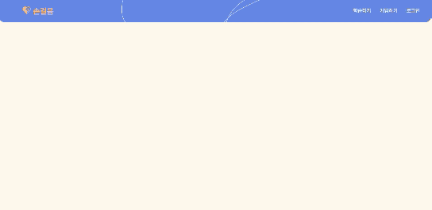

### 로그인

- 아이디, 비밀번호를 입력해 로그인을 합니다.
- 카카오 간편 로그인도 사용할 수 있습니다.


### 회원가입

- 이메일, 닉네임, 비밀번호, 프로필 이미지를 입력해 회원가입을 합니다.
- 올바른 이메일 형식을 사용해야 합니다.
- 2~8자의 닉네임을 사용해야 합니다.
- 8~20자의 비밀번호를 사용해야 합니다.
- 주어진 12개의 프로필 이미지 중 선택합니다.

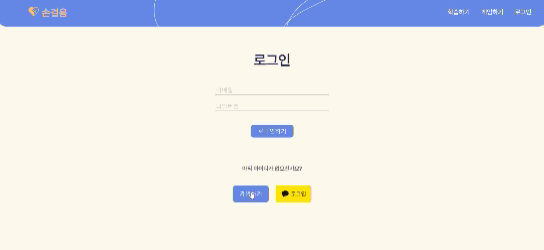

### 학습하기

- 모든 단계에서 화살표 버튼을 눌러 이전 선택으로 돌아갈 수 있습니다.
- 학습모드(배움모드, 실전모드)를 선택합니다.

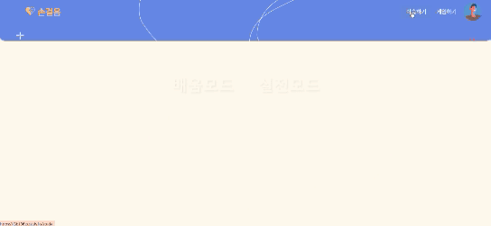

- 리스트 중 원하는 카테고리를 선택합니다.

  - 무한 스크롤이 적용됩니다.

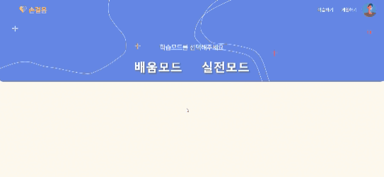

### 배움모드

- 뜻이 적혀있는 단어카드를 클릭해 뒤집을 수 있습니다.
- 뒤집은 카드에서 수어 이미지/영상을 확인할 수 있습니다.
- 화살표 버튼이나 오른쪽 목록에서 다음 단어로 넘기고 선택할 수 있습니다.
- TEST 버튼을 눌러 선택한 카테고리의 “실전모드”를 진행할 수 있습니다.

  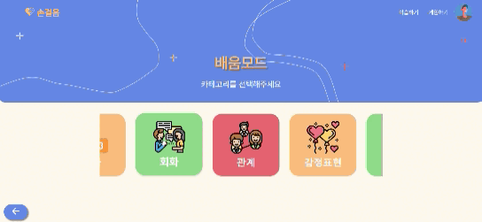

- 별 버튼을 클릭해 나의 단어장에 저장해둘 수 있습니다.
- 목록 버튼을 클릭해 단어 목록을 한 눈에 확인할 수 있습니다.
- 셔플 버튼을 클릭해 단어 목록 순서를 섞을 수 있습니다.

  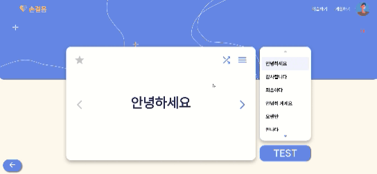

### 실전모드

- 총 10문제에 대한 테스트를 진행합니다.
- 실전 모드 진행 중 언제든 종료할 수 있습니다.
- 실전방법을 선택합니다.

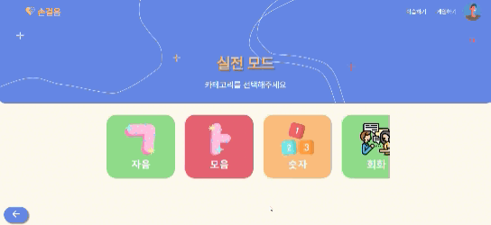

### 실전 - 수어를 단어로

- 튜토리얼을 진행합니다.
- 수어 이미지/영상을 보고 정답 뜻을 입력합니다.
- 정답 시 컨페티 효과가 보이고 자동으로 다음 문제로 넘어갑니다.

  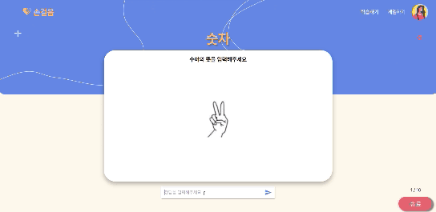

- 오답 시 정답을 확인합니다.
- 충분히 정답을 복습했으면 다음 버튼을 눌러 넘어갑니다.

  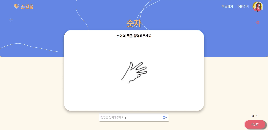

### 실전 - 단어를 수어로

- 튜토리얼을 진행합니다.
- 제시어를 보고 웹캠 앞에서 정답 수어를 표현합니다.
- 화면에서 손동작 인식 상황을 확인할 수 있습니다.
- 정답 시 컨페티 효과가 보입니다.
- 잘 모르겠으면 PASS 버튼을 눌러 넘어갑니다.
- 모범 수어 동작을 확인합니다.
- 충분히 확인 했으면 다음 버튼을 눌러 다음 문제로 넘어갑니다.

  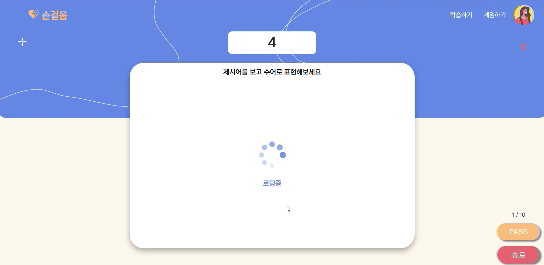

- 실전 테스트가 끝나면 결과창에서 점수를 확인할 수 있습니다.

  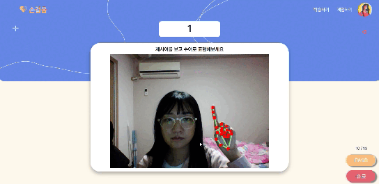

### 게임하기

- 대기 로딩 화면에서 현재 매칭 상황을 확인합니다
- 기다리는 동안 수어에 대한 팁을 확인할 수 있습니다.

  

- 4명이 매칭이 되면 자동으로 게임을 시작합니다.
- 출제자는 제시어와 영상을 보고 수어를 표현해보세요.
- 다른 사람들은 출제자의 표현을 보고 채팅에 정답을 입력할 수 있습니다.

  

- 총 12턴이 지나면 게임이 종료됩니다.
- 게임이 종료되면 결과창에서 나의 점수와 등수를 확인해보세요.

  

### 내 정보

- 상단 바의 나의 프로필 사진을 클릭합니다.
- 사이드 바에서 나의 프로필 사진과 경험치를 확인할 수 있습니다.
- 프로필 수정 버튼을 눌러 닉네임과 프로필 사진을 수정할 수 있습니다.


### 나의 단어장

- 사이드바에서 나의 단어장을 클릭합니다.
- 즐겨찾기(별버튼) 단어를 확인할 수 있습니다.

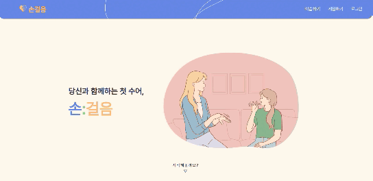

<br>

## 기술 차별점

### 공통 컴포넌트 및 CSS 모듈화

MUI theme과 MUI API를 커스텀하여 쉽게 재사용이 가능하도록 모듈화하였습니다.

### Spring Security

Spring Security에서 제공하는`UsernamePasswordAuthenticationFilter`와 Access Token을 이용하여 인증이 완료된 사용자의 정보를 `HttpServletRequest`에 담아줍니다. 이를 통해 로그인 한 사용자의 정보를 URL에 노출하지 않고 식별할 수 있습니다.

### OpenVidu 세션 관리를 위한 풀링(Pooling) 기법 적용

손:걸음의 화상채팅 기반 게임기능인 "손으로 말해요"는 게임에 입장하는 순서대로 4명의 유저들을 하나의 게임방에 배정하여 게임을 진행하도록 구현하였습니다. 따라서 유입 트래픽이 급격하게 상승하여 새로운 세션을 계속적으로 생성해야 하는 백엔드 서버의 부하를 최소화 하기 위해 **세션 풀링(Pooling) 기법**을 활용하였습니다.

동작 원리는 다음과 같습니다. 백엔드 서버 구동 시 특정 갯수의 화상채팅 세션을 미리 생성해 두어 thread-safe한 ConcurrentLinkedQueue로 구현한 게임 대기열에 저장합니다. 클라이언트가 새로운 방 생성 요청을 보내게 되면 백엔드 서버는 미리 만들어놓은 세션을 사용하고, 4명의 유저가 세션에 입장하면 해당 세션은 ConcurrentHashMap으로 구현한 진행중인 게임방의 저장소로 이동하게 됩니다. 게임이 완료되면 저장소에서 해당 세션은 삭제됩니다.

또한, 게임 대기열의 잔여 세션의 갯수가 특정 하한선 밑으로 떨어지게 되면 특정 갯수만큼 세션이 자동으로 생성되도록 구현하였습니다.

### OpenVidu 세션 풀(Pool) 크기의 유동적 관리

현재 유입중인 게임 유저들이 많을수록 세션 풀의 크기가 유기적으로 변화하여 동적 대응이 필요하다고 생각했습니다. 따라서 게임 유저의 유입량은 현재 진행중인 게임방의 갯수와 정비례한다는 가정 하에, 게임방 저장소 자료구조에 살아있는 세션의 갯수에 따라 대기방에 적용할 multiplier 값을 계산하는 알고리즘을 구현하였습니다.

해당 multiplier는 게임 대기열의 하한선(해당 값 밑으로 세션 갯수가 하락할 시 세션 추가생성)과 이때 추가생성되는 세션의 갯수에 적용되어, 결과적으로 유입 유저가 많을 때 하한선 값과 추가되는 세션의 갯수를 증가시켜서 세션 풀(Pool)의 크기를 키우고, 반대로 유입 유저가 적을때는 풀의 크기를 감소시키게 됩니다.

### OpenVidu 세션 Garbage Collector(GC) 구현

게임 세션은 OpenVidu 라이브러리를 통해 구현한 실시간 WebRTC 세션이고 여러 이유로 인해 비정상적으로 세션이 끊기거나 종료되어야 했을 세션이 아직 살아있는 문제에 대처하고자 이러한 비정상 새션을 처리 및 대채하는 자체 Garbage Collector(이하 GC)를 구현했습니다.

GC는 Spring Scheduler를 활용하여 게임 대기열과 진행중이 게임방 저장소를 주기적으로 탐색하여 비정상 세션을 처리합니다. "손으로 말해요" 게임은 특성 상 게임기간이 짧기 떄문에, GC는 진행중이 게임을 탐색하여 비정상적으로 오래 살아있는 게임 세션을 강제로 종료시키고 삭제합니다. 게임 대기열 또한 GC가 queue의 앞단을 확인하여 연결이 끊어진 세션을 삭제하고 연결이 정상인 세션이 나타날 때까지 세션 삭제를 진행합니다. (진행 도중 대기열 하한값 이하로 세션갯수가 떨어지면 정상적으로 세션이 자동추가됩니다)

### 모션 인식

카메라를 통해 인식한 손의 21개의 랜드마크 배열을 전처리하여 KNN(k-Nearest-Neighbors) 알고리즘을 통해 손동작의 의미를 예측합니다. 카메라에서 인식한 데이터는 (21,3) 크기의 배열이 주어지며 손의 중요 랜드마크마다 x,y,z 총 3차원으로 이루어져있습니다.

예측을 위해 데이터는 손가락 마디를 나타낸 벡터들의 각도 배열로 계산됩니다. 각 단어마다 100개씩의 훈련 데이터가 준비되어 있습니다. 사용자로부터 들어온 값은 준비된 훈련 데이터에서 입력값과 가장 가까운 K개의 데이터를 기반으로 예측됩니다.

### 웹소켓 프로토콜

비디오의 프레임단위로 발생하는 데이터를 웹소켓을 사용하여 장고 서버와 실시간으로 주고 받습니다.

<br>

## 개발환경

### Frontend

- Node.js 18.13.0 (LTS)
- React 18.2.0
  - Redux 4.2.1
- mui/material 5.11.6
- axios 1.2.6
- Sass 1.57.1
- Openvidu Browser 2.24.0
- jQuery 3.6.3

### Backend

- Java
  - Java OpenJDK 1.8.0
  - Spring Boot 2.7.7
    - Spring Data JPA 2.7.6
    - Spring Security 5.7.6
    - JUnit 4.13.2
    - Lombok 1.18.24
    - Swagger 3.0.0
  - Gradle 7.6
- Python
  - Python 3.8.10
  - Django 4.1.5
  - OpenCV 4.5.5.64
  - MediaPipe 0.9.0.1

### Server

- Ubuntu 20.04 LTS
- Nginx 1.18.0
- Docker 20.10.23
- Docker Compose 2.15.1
- OpenVidu 2.24.0

### Database

- MySQL (AWS RDS) 8.0.30

### UI/UX

- Figma 93.4.0

### IDE

- Visual Studio Code 1.75
- IntelliJ IDEA 2022.3.1
- PyCharm 22.3.2

### 기타 툴

- Postman 10.9.4
- Termius 7.56.1

<br>

## 프로젝트 구조

### Frontend (React)

```
SonGeoreum
├── app
├── assets
│   ├── category
│   ├── fonts
│   ├── home
│   ├── level
│   ├── logo
│   ├── profile
│   ├── result
│   └── socialLogin
├── common
│   ├── api
│   ├── button
│   ├── card
│   ├── category
│   ├── error
│   ├── navbar
│   └── routes
└── features
    ├── additional
    ├── auth
    │   ├── login
    │   ├── modify
    │   └── signup
    ├── game
    │   ├── effect
    │   └── openVidu
    │       ├── assets
    │       │   └── images
    │       ├── components
    │       │   ├── dialog-extension
    │       │   ├── sidebar
    │       │   │   └── chat
    │       │   ├── stream
    │       │   └── toolbar
    │       ├── docker
    │       ├── layout
    │       └── models
    ├── home
    ├── study
    │   ├── learn
    │   └── test
    └── voca
```

### Backend (Spring Boot)

```
SonGeoreum
├── api
│   ├── controller
│   ├── request
│   ├── response
│   └── service
├── config
├── db
│   ├── domain
│   └── repository
├── exception
├── jwt
│   └── filter
├── oauth
│   ├── entity
│   ├── handler
│   ├── info
│   └── service
└── util
```

### Backend (Django)

```
SonGeoreum
├── Dockerfile
├── README.md
├── handdetection
│   ├── __init__.py
│   ├── admin.py
│   ├── apps.py
│   ├── consumers.py
│   ├── knn.py
│   ├── migrations
│   │   └── __init__.py
│   ├── models.py
│   ├── routing.py
│   ├── templates
│   │   └── handdetection
│   │       └── lobby.html
│   ├── tests.py
│   ├── urls.py
│   └── views.py
├── knn_dataset_consonant.txt
├── knn_dataset_number.txt
├── knn_dataset_vowel.txt
├── manage.py
├── mywebsite
│   ├── __init__.py
│   ├── asgi.py
│   ├── settings.py
│   ├── urls.py
│   └── wsgi.py
└── requirements.txt
```

<br>

## 와이어프레임

- 홈

.png)

- 나의 단어장

.jpg)

- 학습하기

.jpg)

- 테스트

.jpg)

- 게임

.jpg)

<br>

## ERD

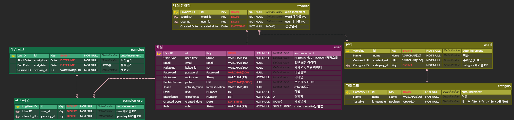

<br>

## 서비스 아키텍쳐


<br>

## 협업 툴

- Git
- GitLab
- Jira
- Notion
- Mattermost

<br>

## 협업 환경

### Git으로 협업하기

Git을 통한 협업 방식은 [우아한 형제들 Git Flow](https://techblog.woowahan.com/2553/)를 기본 베이스로 삼았습니다.

브랜치는 master, develop, dev-front, dev-back, feature 총 5가지를 사용했으며 전략은 다음과 같습니다.

- `master`: 서비스가 출시될 수 있는 브랜치입니다. master 브랜치에 올라온 기능들은 에러 없이 작동하는 상태입니다.

- `develop`: 다음 서비스 출시를 위해 실제 개발이 이루어지는 브랜치입니다.

- `dev-front`, `dev-back`: develop 브랜치에서 분기해서 프론트엔드와 백엔드가 각각 개발하는 브랜치입니다. 프론트엔드와 백엔드 충돌을 최대한 방지하기 위해 만들어졌습니다.

- `feature`: 기능 단위 개발을 위한 브랜치로 dev-front, dev-back에서 분기하여 개발이 끝나면 각각 베이스 브랜치로 병합됩니다.

매주 한 번 이상 dev-front, dev-back 브랜치를 develop 브랜치로 병합 후 배포하여 실제 배포 환경에서 잘 동작하는지 여부를 확인했습니다.

### Jira로 협업하기

매주 월요일 스프린트 회의를 통해 그 주의 목표를 세우고 목표 달성을 위한 구체적인 작업들을 정리했습니다.

유튜브 라이브와 같이 공통적인 일정부터 팀 회의, 파트별 회의, 개인 개발 작업까지 회의를 통해 구체적으로 계획했습니다.

이를 위해 사용된 요소들은 다음과 같습니다.

`에픽`: 어떤 작업이 속하는 최상위 레벨로 학습, 설계, 회의, 개발, 공통 총 5가지 에픽을 만들었습니다.

`스토리`: 에픽에 속하는 작업의 단위입니다. 구체적인 작업 내용을 작성하고 스토리 포인트로 예상 소요 시간을 산정할 수 있습니다. 한 스토리 당 최대 4시간을 넘지 않게 하였고 개인별로 매주 40시간 이상 할당했습니다.

`번다운 차트`: 스프린트의 목표를 달성하기 위해 남은 시간과 남은 스토리 포인트를 확인해 프로젝트의 진척도를 파악할 수 있는 지표입니다.

### Notion으로 협업하기

회의록, 스크럼 회의, 발표 정리, 문서 정리, 기획서 등 자료들을 Notion을 통해 작성 및 관리하였습니다.

- `회의록`: 매일 회의한 내용을 회의록으로 기록하였습니다.
- `프로젝트 일지`: 개인별로 프로젝트 일지(problem-cause-solution)를 작성하였습니다. 프로젝트 일지는 개발하면서 만난 오류와 문제 상황을 정리하고 원인과 해결방법을 적습니다.
- `컨벤션`: 프로젝트의 모든 컨벤션들을 문서화하여 모두가 공유 가능하도록 하였습니다. 기록 및 정리한 컨벤션들에는 Git 컨벤션, Jira 컨벤션, FE 컨벤션, BE 컨벤션이 있습니다.
- `프로젝트 문서 관리`: 요구사항 정의서, 기능명세서, 일정관리 등 공유 문서 관리를 노션에 기록하여 모두가 동일한 목표를 가지고 개발 할 수 있도록 하였습니다.

<br>

## 팀원 역할


<br>

## 프로젝트 산출물

- [요구사항정의서](docs/SonGeoreum_%EC%9A%94%EA%B5%AC%EC%82%AC%ED%95%AD%EC%A0%95%EC%9D%98%EC%84%9C.pdf)
- [기능명세서](docs/SonGeoreum_%EA%B8%B0%EB%8A%A5%EB%AA%85%EC%84%B8%EC%84%9C.pdf)
- [와이어프레임](docs/SonGeoreum_wireframe.png)
- [ERD](docs/SonGeoreum_erd.png)
- [아키텍쳐 다이어그램](docs/SonGeoreum_architecture.png)
- [API DOCS](docs/SonGeoreum_api.pdf)
- [Git Convention](docs/SonGeoreum_git_convention.pdf)
- [포팅 매뉴얼](exec/SonGeoreum_%ED%8F%AC%ED%8C%85_%EB%A7%A4%EB%89%B4%EC%96%BC.pdf)

<br>

## 프로젝트 발표자료

- [중간발표 Presentation](docs/SonGeoreum_%EC%A4%91%EA%B0%84%EB%B0%9C%ED%91%9C%EC%9E%90%EB%A3%8C.pdf)
- [최종발표 Presentation](docs/SonGeoreum_최종발표자료.pdf)

<br>

## 회고

### 서현경

처음으로 프로젝트 일지를 작성해봤는데 내가 무엇을 했는데 복기하는데에도 도움이 됐지만 팀원분들이 열심히 하는 모습이 더 잘 보여서 동기부여가 됐다. 또, 일지에 만났던 오류나 문제를 작성하고는 했는데, 같은 에러가 나면 일지를 보고 고친 적이 종종 있어서 기록이 얼마나 중요한지 알게 되었다. 후반부에는 바쁘다고 제대로 작성하지 못한 게 아쉽다. 전반적으로 정말 멋있는 팀원분들 만나서 긍정적인 시너지를 많이 받았고 덕분에 내 실력도 많이 커진 것 같아서 너무너무 감사하다. 결과가 어떻든 이번 프로젝트 과정에서 최선을 다했기 때문에 후회가 없다!

### 손민혁

기획, 설계부터 개발 및 발표까지 치열하게 대화하며 우리 팀은 서로 동일한 프로젝트를 머릿 속에 그릴 수 있었습니다. 나의 의견을 효과적으로 전달하기 위해서는 명확한 근거와 논리가 뒷받침되어야 했습니다. 덕분에 why? 라는 물음부터 `왜 이렇게 해야하는가` `이렇게 하면 어떤 점이 좋은가` 에 대해 스스로 질문해보며 논리적으로 사고하고 말하는 방법을 많이 훈련할 수 있었습니다.

서로 코드 리뷰를 했던 점도 많은 도움이 되었습니다.
코드 리뷰를 통해 나의 코드의 개선점을 피드백 받을 수 있었고 다른 사람의 좋은 코드 스타일도 배울 수 있었습니다.

이번 프로젝트에서 심리적인 안정감이 높았습니다.
프로젝트에 관련된 궁금한 사항을 친절하게 답변해주고 개발 관련된 피드백을 편안하게 주고 받으며 각자 맡은 임무를 끝까지 해내는 책임감 있는 팀원들이 있었습니다. '나만 잘하면 된다' 라는 생각을 가지고 프로젝트에 임했던 것 같습니다.

기술적으로도 실력이 많이 향상되었다고 느껴집니다. REST API를 설계하면서 좋은 네이밍 규칙, 상황에 따른 파라미터 받는 방법을 고민해볼 수 있었습니다. 또한, Spring JPA 사용해보며 Mybatis와의 차이를 통해 객체지향적인 개발도 접해보았습니다. 무엇보다 웹소켓이라는 기술 Django를 이용해 사용해보며 다른 라이브러리 또는 프레임워크에 대한 두려움이 낮아졌습니다. 이외에도 모션 인식을 위해 파이썬을 자바스크립트로 변환하는 과정에서 tensorflowjs 라는 오픈소스에 기여해본 것도 매우 값진 경험이었습니다. 앗 그리고 가은님과 게임 알고리즘 페어프로그래밍을 해본 것도 너무 재밌었어요 !! (저는 코드를 하나도 치지 않았지만 ㅎㅎ) 제 의견을 듣고 코드를 새로 짜고 또 완성까지 할 수 있어서 너무 짜릿했습니다.

7주 동안 좋은 분위기 속에서 재밌게 개발하고 수상까지 하게 되었습니다. 함께한 손걸음 팀원들 모두 고생많으셨습니다 :)

### 이가은

openvidu라는 WEB RTC 오픈 소스를 활용해보는 좋은 기회였습니다.
오픈 소스의 코드를 이해하는 과정과 우리 프로젝트 기획에 맞게 커스텀하는 과정을 통해
상대 코드를 읽는 법, 코드의 흐름 파악하기, 오픈 소스 활용 기능 구현 등 많은 부분을 배울 수 있었습니다.
프로젝트를 기획 할 때 조금 더 사용자에게 편리한 방향으로 서비스를 기획하고자 했던 것과,
팀원들 모두가 동일한 프로젝트를 머릿속에 그리고 개발할 수 있도록
기획 설계 소통에 열심히 임했던 모든 과정들에서 협업에 대한 많은 깨달음도 얻을 수 있었습니다.
좋은 팀원들 덕분에 마지막의 마지막까지 힘내서 프로젝트를 마무리 할 수 있었던 것 같습니다.
모두 감사했습니다:)

### 임영묵

기획단계부터 최종 구현 및 배포까지 많은 애정을 갖고 임했던 프로젝트였습니다. 여러명의 팀원들과 팀을 꾸려 약 6주간의 기간동안 진행해보는 첫 프로젝트였어서 설램반 걱정반, 그리고 최대한 멋진 결과를 만들어 내고 싶은 강한 의지를 갖고 임한만큼 좋은 결과뿐만 아니라 개발 내,외적으로 많은 것을 얻어갈 수 있는 프로젝트였습니다.

본 프로젝트를 진행하며 WebRTC의 작동원리에 대한 이해, 이를 바탕으로 OpenVidu 라이브러리를 활용한 백엔드 Spring Boot 서버 구축 및 WebRTC 세션 관리, 세션 풀(Pool) 및 자체 세션 Garbage Collector 구현 알고리즘 설계 등 기술적인 부분에 대한 이해도와 구현력을 발전시켰습니다. 또한 사전 지식이 없었던 CI/CD 분야를 담당하게 되어 AWS, Docker, Jenkins 등에 대한 집중 학습을 통해 성공적으로, 비교적 빠른 기간내에 빌드 및 배포 자동화 시스템을 구축할 수 있었습니다.

기술적인 부분 뿐만 아니라 팀워크에 대해서도 많은 것을 배울 수 있었습니다. 저희 팀원들간의 뚜렷하고 효율적인 소통, 각자 맡은 부분에 대한 명확한 이해와 책임감, 그리고 서로와 서로의 의견에 대한 존중 및 배려는 팀 분위기에 자연스럽게 긍정적인 기여를 하였고 이는 팀 시너지 효과를 증대시키는대에 큰 역할을 했다고 생각합니다. 팀원들이 6명이 모여서 단순히 6배의 효과를 내는 것이 아닌 그 이상의 효과를 창조하는 것을 경험하며 다소 추상적이었던 좋은 팀이란 무엇인가, 라는 질문에 대한 명확한 답을 얻을 수 있었습니다.

기회가 된다면 팀원분들과 다른 프로젝트를 재밌게 또 해보고 싶습니다! BBB 팀원분들 정말 고생 많으셨습니다!

### 황정주

`대화`와 `기록`의 중요성을 알게 된 경험이었습니다. 기획 단계에서부터 정말 많은 회의를 하며 모든 팀원이 동의할 때까지 대화를 한 덕분에 개발 단계에서 어떤 기능에 대해 의구심을 갖는 팀원이 없었습니다. 또한 궁금증이 생겼을 때 철저하게 기록한 덕분에 노션에 적힌 것을 보고 해결되는 경우가 많았고 기록되지 않은 내용이더라도 거리낌 없이 질문할 수 있는 분위기여서 더 많이 배웠습니다. 그리고 회원 관련된 부분을 담당하면서 보안에 대해 다시 생각해 볼 수 있어서 좋았습니다. 1학기 때는 아무렇지 않게 데이터를 주고받았던 방식이 보안상 취약점이 있을 수 있다는 것을 깨달았고 최대한 외부로 사용자 정보가 노출되지 않도록 노력하면서 정말 많은 것들을 배웠던 것 같습니다.

마지막으로 우리 BBB 팀원들 너무 감사했습니다. 어려울 것 같다던 손 인식을 완벽하게 구현하신 `캡틴민혁님`, 배포는 처음이라고 전혀 모르겠다더니 어느새 배포 마스터가 되어있고 OpenVidu 세션 관리까지 멋지게 구현하신 `빛영묵님`, 같이 로그인 구현하면서 끊임없이 대화하면서 많이 깨닫게 해주시고 손걸음 기획자이자 발표도 최고인 `냐냐냐 오연님`, 우리 팀 핵심 기능인 OpenVidu로 게임하기 구현하면서 정말 많이 고생하시고 끝내 완벽하게 구현하신 `큐티 가은님`, 프론트장 하면서 Back, Front 간에 의사소통이 잘 이루어질 수 있게 해주시고 손 인식하기 위해 따로 구현된 장고 서버와 연동해야 해서 어려웠을 것 같은 학습하기 구현, MUI 버튼 커스텀 해서 모듈화, UCC 진짜 완벽하게 만들어주신 `엔젤 현경님`까지 이렇게 대단한 팀원들과 함께 할 수 있어서 행복했던 7주였습니다.❤❤❤❤

### 권오연
첫 프로젝트에서 좋은 팀원들과 좋은 성과를 공유할 수 있어 다행이고, 또 영광입니다.

매일 꼬박꼬박 8시간씩, 사소한 것 하나하나 명분을 찾고 치열하게 토론하며 구성한 기획을 해 본 경험은 정말 잊을 수 없을 것 같습니다. 그 당시에는 개발이 늦어질까 초조하기도 하고 피곤하기도 했는데, 돌이켜보니 덕분에 탄탄한 기획이 되어 순조롭게 개발까지 이어질 수 있었고 또 팀원 간의 결속력을 다질 수 있었던 시간이었음을 깨달았습니다. `시간이 얼마가 들어도 모두가 납득할 수 있는 합의를 도출하자.` 모두가 이 기준에 공감해서 가능했던 일이었지만, 지키기 위해서 모두가 얼마나 큰 열정과 인내, 그리고 배려를 쏟았을까요! 덕분에 팀을 오롯이 믿고 나의 일에 집중할 수 있는, 그야말로 '팀워크'의 가치를 배울 수 있었습니다.

또한 정말 다른 성향의 6명의 장점이 더해져 6인 이상의 시너지를 낸다는 것이 무엇인지 체감할 수 있었는데, 개인적으로는 부족한 부분인 '꼼꼼함'에 있어 크게 도움을 받았습니다. 지라와 노션 등 `기록`을 통해 모두가 동일하게 명세와 현황을 공유하고, `컨벤션`을 엄격하게 따른 덕에 업무 효율이 크게 향상되었습니다. 또한 프로젝트 일지로 저의 작업을 `기록`하게 했기 때문에 지금까지 생생하게 기억하고, 회고할 수 있다고 생각합니다. 이러한 경험은 이번 프로젝트를 넘어 프로 개발자로서 성장하는 데에도 크게 기여할 것입니다.

개인 개발 역량 측면에서도 얻은 게 많은 프로젝트였습니다. 로그인 기능을 맡아 구현하면서, 클라이언트-서버 간 통신과 보안에 대해 깊이 학습할 수 있었습니다. 개발을 하다보니 쿠키·세션 개념, 토큰의 용도와 보안 이슈, JWT의 활용, 데이터 저장 위치나 전달 방법에 따른 보안 위험 요소 및 방지 방안 등을 자연스럽게 익히게 되었고, 이 모든 사항을 꼼꼼하게 고려해 탄탄한 사용자 인증 체계를 구현했습니다. 또한 React의 생애주기를 새롭게 학습하고, 이를 고려하며 적절하게 동기·비동기적 처리를 해보며 이해를 높였습니다. 이번 프로젝트를 통해 프론트엔드 개발자로서 한층 더 성장했다고 자부할 수 있어 기쁩니다.

그리고 무엇보다, 비슷한 가치관을 가진 사람들과 함께할 수 있어 행복한 프로젝트였습니다! 사람들의 니즈를 발굴하고 더 나은 삶을 만드는 것이 목표인 저는, 목표를 현실로 이루기 위한 수단으로 개발을 배우기 시작했습니다. 그리고 저의 가치에 공감하는 팀원들을 만난 덕분에, 첫번째 프로젝트에서 완벽한 첫걸음을 뗄 수 있었습니다. 손걸음 프로젝트로 느낀 보람은 제 개발 인생에 큰 원동력이 될 것 같습니다. 값진 경험을 하게 해준 팀원들에게 감사의 인사를 전합니다!

<br>

## 서비스 체험 후기

- “농인들에겐 제 1의 언어가 수어입니다”라는게 이 서비스를 관통하는 문장이 아닐까 합니다. 우선 감동이 느껴졌습니다.

- ‘누구나’ ‘쉽게’ 참여할 수 있다는 게 손걸음 서비스의 최고 장점이라고 생각됩니다. 그만큼 UI가 직관적이어서 사용에 어려움이 전혀 없었습니다. (녹여낸 프론트단에 박수를…)

- “당신은 사랑받기 위해 태어난 사람”을 초등학교때 해본 이후로 수어를 쓸 일이 없었는데, 만약 쓸 일이 생긴다면 이 서비스가 큰 도움을 주리라 생각했습니다.

- 학습하기 배움모드에서 카드를 한 번 더 누르면 정답이 나오는 줄 모르고, TEST를 눌러보는 등, 찾는 과정이 있었습니다. “정답을 확인하려면 여기를 클릭하세요” 같은 안내문구가 있었으면 더 좋았을 것 같습니다.

- 게임하기에서 정확히 어떤 방식으로 진행되는지 살짝 헤맸습니다. 이에 관한 안내과정이 있으면 더욱 질좋은 서비스가 될 것 같습니다.

- 수어를 사용할 일이 생길 때, 검색하기 기능같은 것이 있다면 사용자접근성이 더 높아질 것 같습니다!

- 정말 감명깊은 서비스였습니다! 추천합니다~!
